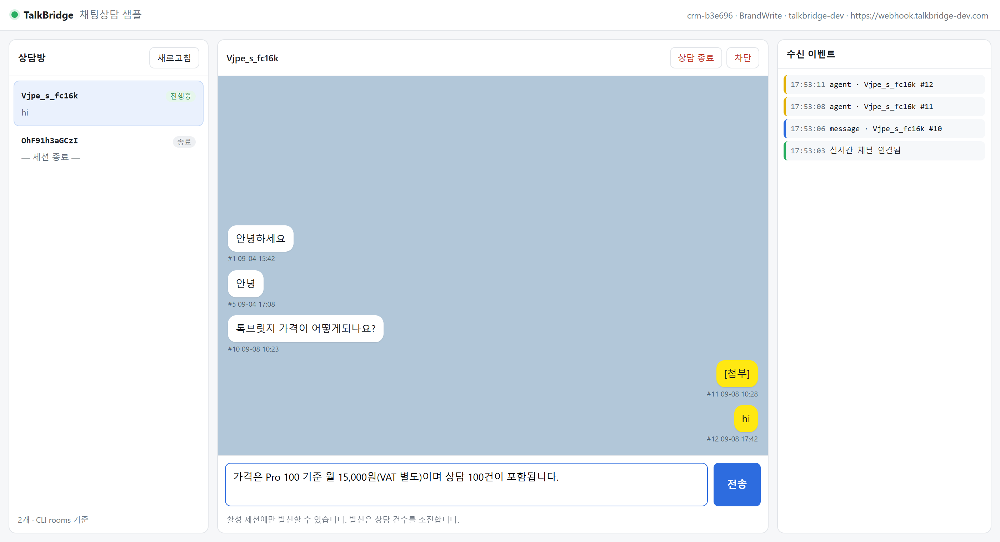
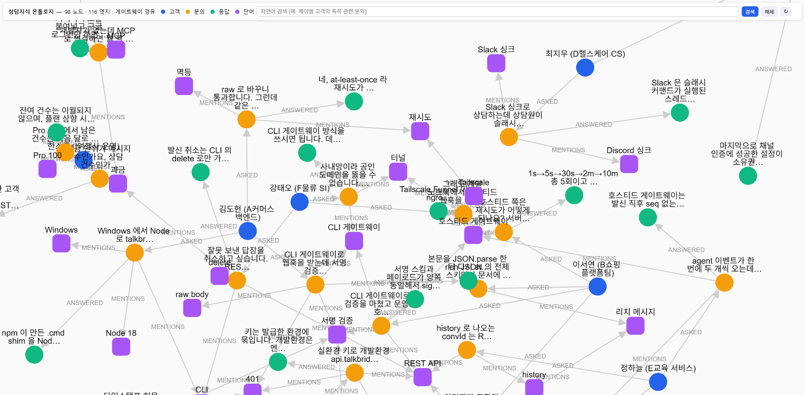
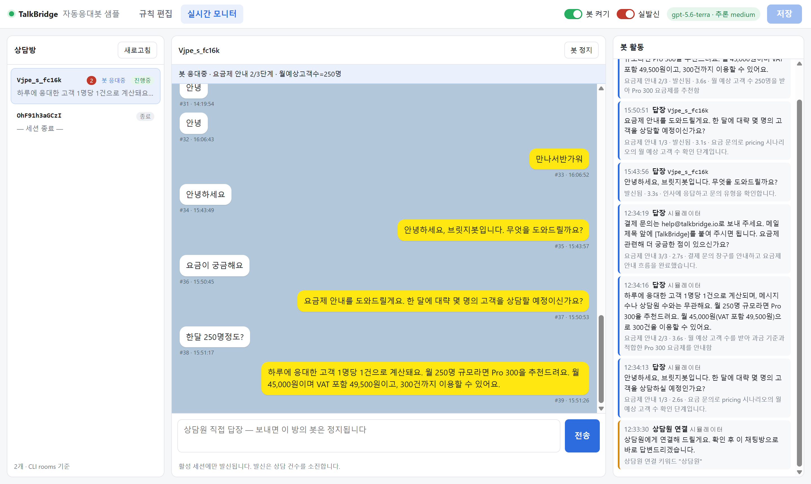

# TalkBridge 파트너 연동 가이드 · 샘플

카카오 상담톡을 자체 시스템·AI 에이전트에 연결하는
[TalkBridge](https://api.talkbridge.io/) 의 **파트너용 참조 구현 모음**입니다.

파트너가 고객사 구축에 들어가는 시간을 줄이고, 코드 가이드로 삼을 수 있도록
공개 매뉴얼을 실측으로 검증해 정리하고, 연결 방식별로 동작하는 샘플을 제공합니다.

> **소개 페이지**: <https://blumnai-playground.github.io/talk-bridge/> — TalkBridge CLI · MCP · API 한눈에 (이 저장소의 `site/` 를 `v*` 태그 기준으로 GitHub Pages 에 배포)

## 구성

| 경로 | 내용 |
|---|---|
| [`docs/`](docs/) | 공개 매뉴얼 요약 — 도메인 모델, API·CLI 스펙, 요금, 온보딩 |
| [`sample-project/`](sample-project/) | 연결 방식별 동작하는 샘플 (멀티 프로젝트) |
| [`site/`](site/) | 소개 페이지 (GitHub Pages) — `v*` 태그 푸시로 배포 |

## 샘플

| # | 샘플 | 이런 때 쓰세요 | 연결 방식 | 공개 도메인 | 상태 |
|---|---|---|---|---|---|
| 01 | [`sample-project/01-cli-gateway`](sample-project/01-cli-gateway/) | CLI 로 **기본 채팅상담 화면**을 빠르게 만들고 싶을 때 — 노트북·사내망에서 도메인 없이 바로 검증, 사람이 답하는 상담 툴의 출발점 | CLI + 로컬 게이트웨이 | **불필요** | ✅ 완료 |
| 02 | [`sample-project/02-api-webhook`](sample-project/02-api-webhook/) | 이미 운영 중인 **서버·백엔드에 상담을 붙일 때** — REST 로 조회·발신, 웹훅으로 영속 전달·재시도. 운영 전환·다중 인스턴스의 기준 구현 | REST API + 호스티드 웹훅 | 필요 | ✅ 완료 |
| 03 | [`sample-project/03-cli-knowledge-graph`](sample-project/03-cli-knowledge-graph/) | **과거 상담을 분석하거나 자동 상담의 근거 데이터**를 만들고 싶을 때 — 고객→문의→응답 그래프를 Cypher 프리셋으로 조회, 온톨로지 설계 참고 | 01 + 상담지식 그래프 프리셋 조회 (AI 미사용) | **불필요** | ✅ 완료 |
| 04 | [`sample-project/04-cli-autoreply-bot`](sample-project/04-cli-autoreply-bot/) | 상담원 대신 **자동응대봇**이 먼저 받게 하고 싶을 때 — 웹에서 지식·간단 시나리오(플로우)를 구성하고, AI 가 **첫 응대 이후 맥락을 이어** 답한 뒤 필요하면 상담원에게 넘김 | 01 수신 + OpenAI Responses API (`gpt-5.6-terra`) | **불필요** | ✅ 완료 |
| 05 | [`sample-project/05-cli-jev-faq-bot`](sample-project/05-cli-jev-faq-bot/) | 반복 FAQ·정해진 절차를 **정해진 문구로 0.2초 만에** 자동응대하고 싶을 때 — 문장을 만들지 않고 **고르는 AI**(TypeSafe Jev)가 FAQ·선택지형 시나리오를 판정, 확신도로 자동 답변·되묻기·상담원을 가름 (한국어 평가 67건 · 자동 답변 오답 0) | 01 수신 + TypeSafe Jev System One (`jev-latest`) | **불필요** | ✅ 완료 |

[](sample-project/01-cli-gateway/)

01 은 게이트웨이 데몬이 **내 쪽에서 밖으로** 나가 붙기 때문에 공인 도메인·DNS·TLS·
방화벽 설정이 하나도 필요 없습니다. 사내망이나 노트북에서 바로 검증할 수 있습니다.
02 는 TalkBridge 가 **내 공개 엔드포인트로 들어오는** 방식이라 그 인프라가 필요한 대신,
전달이 영속되고 재시도가 넉넉합니다.

### 새 기능 — 이미지 첨부 · 고객 첨부 확인 · 발신 취소 (2026-10)

01·02 상담 화면에 세 기능이 들어갔습니다. 01 은 CLI v1.3.1 로 실채널 실측까지 마쳤습니다.

**CLI 로 먼저 확인하고, 웹훅 + API 에 그대로 적용할 수 있습니다.**
01(CLI × 로컬 게이트웨이)은 공개 도메인 없이 노트북에서 바로 실발신·실수신을 해 볼 수 있습니다.
CLI 의 `--json` 출력은 필드명이 REST 와 같고, 로컬 게이트웨이가 보내는 웹훅도 호스티드 웹훅과
**같은 서명·같은 페이로드**(`phase`·`serial`·`serials`·`deleted`)입니다. 그래서 01 에서 확인한 동작이
02(REST API × 호스티드 웹훅)에서도 그대로 성립합니다.

```
01 CLI 로 확인                         02 웹훅 + API 로 적용
send --file a --file b --text …   →   POST /api/agent/send/attachments (multipart)
delete --serial bw-…              →   POST /api/agent/delete
로컬 게이트웨이 → /webhook          →   호스티드 게이트웨이 → https://<내 도메인>/webhook
```

실제로 두 샘플은 수신 처리(`webhook.js` — 본문 조회 2줄만 다름), 서명 검증·저장소·발신 serial 기억(`signature.js`·`store.js`·`outbox.js` — 동일),
상담 화면(`public/` — 문구만 다름)을 공유합니다. 바뀌는 것은 조회·발신을 **CLI 로 부르느냐(`cli.js`), REST 로 부르느냐(`api.js`)** 한 파일뿐입니다.
01 에서 기능을 검증한 뒤 운영 서버로 옮길 때는 `cli.js` 자리를 `api.js` 로 바꾸고, 수신 URL 을 센터의 Webhook 연결에 등록하면 됩니다.

| 기능 | 화면에서 | 연동 (01 CLI / 02 REST) |
|---|---|---|
| **이미지·파일 첨부 발신** | 입력창 왼쪽 **첨부** → 여러 개 선택 → 캡션과 함께 전송 | `send --file … [--text]` / `POST /api/agent/send/attachments` |
| **고객 첨부 확인** | 고객이 보낸 사진은 썸네일, 동영상·음성·파일은 링크 칩으로. 묶음사진도 한 말풍선에 모두 | 본문의 `[photo] https://talk.kakaocdn.net/…` 줄을 파싱 |
| **발신 취소** | 내 말풍선에 마우스를 올려 **발신 취소** (발송 후 24시간 이내). 묶음은 남은 장을 모두 삭제 | `delete --serial` / `POST /api/agent/delete` + 웹훅 `kind:"deleted"` |

- 모든 발신 응답에 오는 `serial`(`bw-…`)이 취소의 키입니다. 묶음 첨부는 장마다 serial 이 따로 옵니다
- 고객 방에는 「메시지가 삭제되었습니다」가 남고, 상담 건수는 돌아오지 않습니다
- 카카오 CDN URL 이 아닌 링크(고객이 직접 입력한 링크)는 이미지로 띄우지 않습니다. CDN URL 은 만료되므로 보관이 필요하면 수신 직후 사본을 저장하세요
- 실측 응답·웹훅 원문과 주의점은 [01 README §4.1](sample-project/01-cli-gateway/README.md#41-첨부--발신-취소-실측-cli-v131-2026-10-06), 02 는 [§6.7~6.9](sample-project/02-api-webhook/README.md#67-고객-첨부-확인--본문-안의-photo-url)

03 은 **톡브릿지 CLI 로 상담 Agent 기능을 확장하고자 할 때** 활용할 수 있는 샘플입니다 — 톡브릿지가 부가 기능인
**상담 분석 Agent** 로 어떻게 확장될 수 있는지를 보여주는 데모성 구현입니다. 그래프 기능은 상담 내역으로 온톨로지를 구축할 때
참고할 수 있는 연구 샘플이며, CLI 가 파트너사의 온톨로지를 위해 공식 제공하는 기능은 아닙니다. CLI 가 설치된 곳에서
**온디바이스로 가볍게 로컬 실험**을 할 수 있고, 실 운영에서는 여기서 확인한 스키마·조회 패턴을 바탕으로 규모에 맞는 그래프 DB 를
별도 구축·운영하는 것을 권장합니다.

[](sample-project/03-cli-knowledge-graph/#talkbridge-cli--그래프-확장편)

03 의 그래프는 톡브릿지 이용 매뉴얼을 베이스로 테크 문의를 가상으로 연출한 데모입니다. 고객명은 개인정보라 TalkBridge 가 제공하지 않으며,
대화 중 파악되면 고객 메모 저장 기능으로 파트너가 관리합니다. 그래프 엣지를 따라 전문 분석이나 자동 상담 대응에 활용할 수 있습니다 —
[TalkBridge CLI — 그래프 확장편](sample-project/03-cli-knowledge-graph/#talkbridge-cli--그래프-확장편).

04 는 수신한 고객 메시지를 **자동응대봇**이 받습니다. 봇 페르소나·대응 지식·간단 시나리오(단계별 플로우)를 웹에서 구성하고,
같은 상담 세션의 이력과 진행 상태(시나리오·단계·받은 정보)를 매 턴 OpenAI 에 넘겨 **두 번째 답장부터 맥락이 이어지게** 합니다.
카카오 발신 없는 시뮬레이터와 dry-run 으로 먼저 다듬고, 상담원 연결이 필요하면 그 방의 봇이 멈춥니다.
아래는 톡브릿지 내부에서 **실제 카카오톡 채널로 문의해 본 실상담 시뮬레이션** 결과입니다 — 봇이 요금 문의에 규모를 묻고,
"한달 250명정도?" 라는 짧은 답을 기억해 요금제를 추천했습니다.

[](sample-project/04-cli-autoreply-bot/#실상담-시뮬레이션--톡브릿지-채널에-실제로-문의해-봤습니다)

04 의 내부 동작과 구성 절차(페르소나 → 지식 → 시나리오 추가 → 시뮬레이터 데모)는
[`04 개발 가이드 · 워크스루`](sample-project/04-cli-autoreply-bot/docs/autoreply-bot-guide.md) 에 화면과 함께 정리했습니다.

자세한 비교와 선택 기준은 [`sample-project/README.md`](sample-project/README.md) 를 보세요.

## 시작하기

```bash
# CLI 설치 + 로그인
npm install -g @blumn-ai/talkbridge-cli    # dev 채널은 @blumn-dev/talkbridge-cli
talkbridge login
talkbridge whoami                           # "상담 가능 채널" 키 확인 (v1.3+, 구 CLI 는 브랜드 키)

# 01 샘플 실행
cd sample-project/01-cli-gateway
cp .env.example .env                        # TB_BRAND, TB_WEBHOOK_SECRET 채우기
npm run doctor                              # 진단
npm run gateway:setup && npm run gateway:start   # 이미 떠 있으면 talkbridge gateway restart (sink 반영)
npm start                                   # http://127.0.0.1:8787/
```

## 맞춤 상담 Agent 설계 — 블룸 정원의 하네스

이 저장소에는 **톡브릿지를 이해하는 하네스, 블룸 정원의 하네스**가 탑재되어 있습니다 ([`harness/`](harness/)).
하네스는 정원이고, 그 안에서 일하는 전문가 에이전트는 꽃입니다. 정원을 가꾸는 관리인이 **정원지기**입니다.
수신 웹훅 계약, CLI 스펙, 샘플 이식 제약 같은 도메인 지식과 그것을 기준으로 검수하는
전문가 에이전트가 들어 있어, 파트너가 샘플을 고객 맞춤으로 바꾸거나 AI 상담 Agent 를 얹을 때
**톡브릿지 규칙을 어기지 않았는지 설계 단계에서 점검하고 테스트**해 볼 수 있습니다.

Claude Code 에서 [정원의 하네스 플러그인 (harness-kakashi)](https://github.com/psmon/harness-kakashi)을 설치하면 바로 쓸 수 있습니다.

```
/plugin marketplace add psmon/harness-kakashi
/plugin install harness-kakashi@harness-kakashi-skills
```

```
/harness-creator            ← 정원지기를 부른다 (현재 상태와 사용법 안내)
/harness-creator 전체 점검해  ← 3 전문가가 샘플 전체를 검수하고 종합 보고
/harness-creator 변경 점검해  ← 내가 고친 부분만 관련 전문가가 검수
/harness-chakra             ← 작업 후 토큰(차크라) 사용량 감사
```

한 번 부른 뒤에는 슬래시 없이 `보안 점검해`, `문서 검증해` 처럼 바로 말하면 됩니다.

| 전문가 | 보는 것 |
|---|---|
| 웹훅 경비대장 | 서명 검증 · 시크릿 취급 · 멱등 · 인젝션 · `agent` echo 무한 루프 |
| 이식 감독관 | 의존성 0 · Node 18+ · Windows/macOS/Linux · dev/prod 채널 · README 와 실행 일치 |
| 문서 대조관 | 공개 매뉴얼 요약 ↔ README ↔ 코드의 스펙 드리프트 |
| 개선 수집관 | 실측으로 드러난 CLI·API·문서의 결함·제약을 **다음 개선 예고 스펙**으로 — [`harness/knowledge/cli-feat/`](harness/knowledge/cli-feat/) |

CLI 의 알려진 한계와 지금 쓸 우회, 그리고 다음 버전에서 바뀔 내용은(v1.0.0 기준 예고 10건 중 7건이 v1.1.0 에 구현됨)
[`harness/knowledge/cli-feat/README.md`](harness/knowledge/cli-feat/README.md) 에 한 표로 있습니다. 설계 전에 한 번 훑어보세요.

**커스텀 개발 요청 예시** — 샘플을 출발점으로 Claude Code 에 이렇게 요청하면, 하네스의 도메인 지식(웹훅 계약·CLI 스펙·이식 제약)을 기준으로 구현하고 점검합니다.

```
sample-project/01-cli-gateway 에 상담 분배 기능을 추가해줘
  → 새 상담(reference)이 오면 담당 상담원에게 라운드로빈으로 배정하고 화면에 담당자를 표시

sample-project/01-cli-gateway 에 업무시간 외 자동 응답을 넣어줘
  → schedule 밖 시간에 message 가 오면 안내 문구를 send 하고, agent echo 는 응답 대상에서 제외

sample-project/04-cli-autoreply-bot 에 업무시간 시나리오를 추가해줘
  → schedule get 으로 상담시간을 읽어 지침의 현재 상태에 넣고, 시간 외에는 접수만 받고 상담원 연결 예약

sample-project/01-cli-gateway 의 인메모리 저장소를 SQLite 로 바꿔줘
  → delivery_id UNIQUE 멱등 테이블 + 메시지 테이블 (샘플 → 운영 전환의 첫 단계)
```

구현이 끝나면 `변경 점검해` 한 번으로 `agent` echo 필터 누락(무한 루프), 서명 검증 우회,
활성 세션 밖 발신 같은 톡브릿지 규칙 위반을 커밋 전에 잡습니다.
필요한 전문가를 더 심으려면 `새 에이전트 추가해` 라고 하면 됩니다.

하네스 구조와 검수 기준: [`harness/docs/README.md`](harness/docs/README.md)

## 참고

- 공개 매뉴얼: <https://api.talkbridge.io/>
- 매뉴얼 요약: [`docs/talkbridge-manual-digest.md`](docs/talkbridge-manual-digest.md)
- 기술 문의: TalkBridge 디스코드 커뮤니티 / `help@talkbridge.io`
