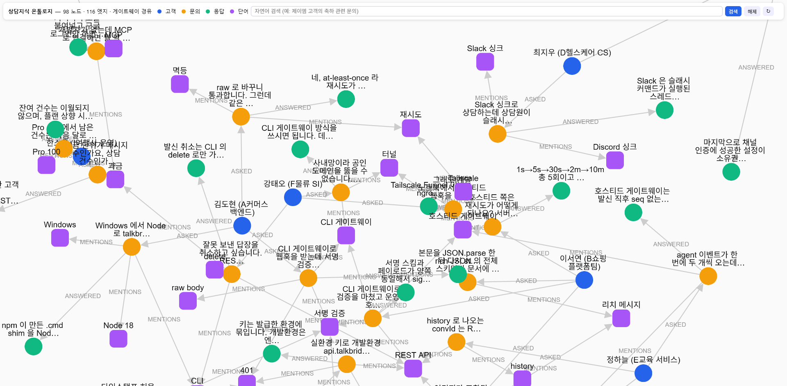

# 03 · CLI × Gateway + 상담지식 그래프 — 채팅상담 샘플

> 샘플 모음 인덱스는 [`../README.md`](../README.md) 를 보세요.
> 이 샘플은 [`01-cli-gateway`](../01-cli-gateway/) 를 **그대로 복제한 뒤** 상담지식 그래프 탐색만 얹은 것입니다.
> 01 은 손대지 않았습니다 — 그래프가 필요 없는 파트너는 01 을, 필요한 파트너는 03 을 가져가면 됩니다.

TalkBridge CLI 에는 **상담지식 온톨로지(그래프)** 가 내장되어 있습니다. 게이트웨이가 상담을 받을 때마다
`고객 → 문의 → 응답` 그래프(LadybugDB)에 적재하고, 문의가 언급한 단어(Entity)를 잇습니다.
이 샘플은 그 그래프를 **미리 만들어진 Cypher 조회 10종**으로 탐색하는 패널을 01 상담 화면 옆에 붙인 것입니다.
AI(자연어 검색·LLM 엔티티 추출)는 쓰지 않습니다 — 그건 다음 샘플의 몫입니다.

> **이 기능의 위치** — CLI 의 상담지식 그래프는 **상담 내역을 활용한 온톨로지 구축에 참고할 수 있는 연구 샘플 제공 기능**입니다.
> CLI 가 파트너사의 온톨로지를 위해 공식 제공하는 기능은 아닙니다. CLI 가 설치된 곳에서 **온디바이스로 라이트웨이하게** 동작하므로
> 로컬에서 바로 써 볼 수 있고, 여기서 확인한 스키마·조회 패턴을 참고해 **규모에 맞는 그래프 DB 를 채택한 뒤 적용**하는 것을 권합니다.
> 운영 전환 시 고려할 점은 [§7](#7-운영으로-옮길-때) 에 있습니다.

- 런타임: **Node.js 18+**, 의존성 **0개** — 그래프 DB 는 CLI 가 소유·관리, 이 샘플은 읽기만
- CLI: **`talkbridge-dev` v1.1.0+** — 전역 `--json`, 게이트웨이 조회 API, `knowledge query --write` 를 쓴다 (01 은 v1.0.0 도 됨)
- 프론트: **바닐라 JS** (01 화면 + 오른쪽 열에 그래프 패널)
- 데모 데이터: **톡브릿지 상담센터에 파트너 개발자 10명이 CLI·API 연동을 문의하는 18건의 대화** (`data/demo-dataset.json`)
- 검증 환경: `talkbridge-dev` v1.1.0 · LadybugDB v0.18.0 · Windows 11 · Node 22.18 (v1.0.0 실측 기록은 §5)

---

## TalkBridge CLI — 그래프 확장편

[](docs/screenshot-graph.png)

> `talkbridge-dev knowledge view` 가 여는 상담지식 온톨로지 화면 — 98 노드 · 116 엣지, 게이트웨이 가동 중 조회 API 경유.
> 파랑 = 고객, 주황 = 문의, 초록 = 응답, 보라 = 단어(엔티티).

이 그래프는 **톡브릿지 이용 매뉴얼을 베이스로, 파트너 개발자에게서 발생할 법한 테크 문의를 가상으로 연출**한 것입니다
(`data/demo-dataset.json`, 18건의 대화). 서명 검증 · 401 · raw body · 멱등 · agent echo · Tailscale 터널 · Windows shim 같은
실제 연동 과정의 질문이 `고객 → 문의 → 응답 → 언급 단어` 로 이어집니다.

- **고객명은 개인정보라 TalkBridge 가 제공하지 않습니다.** 그래프의 고객 노드는 카카오 `userKey` 하나로 시작하고,
  대화 중 파악된 이름·연락처·메모는 CLI 의 고객 메모 저장 기능(`/cs-memo`, CRM 싱크)으로 **파트너가 직접 관리**합니다.
  데모의 "김도현 (A커머스 백엔드)" 같은 이름은 그렇게 저장된 메모가 그래프에 얹힌 모습을 연출한 것입니다.
- **엣지가 곧 분석 축입니다.** `ASKED` 로 고객별 문의 이력을, `ANSWERED` 로 미응답 건을, `MENTIONS` 로 자주 나오는 주제를 따라갈 수 있어
  전문적인 상담 품질 분석이나 **자동 상담 대응(유사 문의 → 과거 응답 재활용)** 의 근거 데이터로 쓸 수 있습니다.
- 이 화면은 CLI 내장 뷰이고, 아래 샘플은 같은 그래프를 **미리 만들어진 Cypher 프리셋 10종**으로 상담 화면 옆에서 조회하는 구현입니다.

---

## 0. 01 과 무엇이 다른가

```
01-cli-gateway                          03-cli-knowledge-graph (이 샘플)
┌────────┬──────────────┬──────────┐    ┌────────┬──────────────┬──────────────┐
│ 상담방 │    대화      │ 수신로그 │    │ 상담방 │    대화      │ 지식 그래프  │
│        │              │          │ →  │        │ [고객타임라인]│ 프리셋 10종  │
│        │              │          │    │        │              ├──────────────┤
│        │              │          │    │        │              │ 수신로그     │
└────────┴──────────────┴──────────┘    └────────┴──────────────┴──────────────┘
```

| | 01 | 03 |
|---|---|---|
| 수신·발신·서명·멱등 | 동일 | **동일** (`signature.js`·`webhook.js`·`store.js`·`sse.js` 무수정) |
| 그래프 조회 | — | `server/graph.js` — 프리셋 Cypher 10종 + 스냅샷 캐시 (`knowledge search --cypher --json`) |
| 서버 API | 01 표 | + `/api/graph/presets` · `/snapshot` · `/preset/:id` · `/cypher` · `/status` |
| 화면 | 3열 | 오른쪽 열을 **그래프(위) + 수신로그(아래)** 로 분할, 대화 헤더에 **고객 타임라인** 버튼 |
| 조회 방식 | CLI 텍스트 파싱 | CLI **`--json`** (필드명 = REST) — 파서 없음 |
| 스크립트 | doctor 7종, gateway | doctor **8종**, + `knowledge.mjs` (install/build/view), + `seed.mjs` (데모 데이터), + `write-window.mjs` (쓰기 때만 게이트웨이 정지) |
| 기본 포트 | 8787 | **8789** |

---

## 1. 그래프 스키마 (실측)

```
(:Customer {id = userKey, brand, name, phone, memo})
    -[:ASKED]-> (:Inquiry {id = "<convId>#<turn>", text, ts})
                    -[:ANSWERED]-> (:Response {id, text, byAgent, ts, loadedAt})
                    -[:MENTIONS {confidence}]-> (:Entity {name, kind})
```

- `ts` 는 **원 메시지 시각**(UTC), `loadedAt` 은 적재 시각 (v1.1.0 — v1.0.0 은 `ts` 에 적재 시각이 들어갔다)
- `Customer.id` 가 곧 카카오 `userKey` — 상담 화면의 방과 그래프의 고객이 같은 키로 이어집니다
- `MENTIONS` 는 **Inquiry 에서만** 나갑니다 (Response 에서 걸면 `Binder exception`)
- `Entity` 의 기본키는 `name`. 데모에서는 `kind` 를 제품 · 개념 · 명령 · 오류 · 환경 · 요금 으로 씁니다
- 실운영에서는 게이트웨이가 수신 시 자동 적재하고, `Entity`/`MENTIONS` 는 LLM 엔티티 추출이 채웁니다

---

## 2. 빠른 시작

```bash
# 0) 사전: CLI 설치 + 로그인 (01 과 동일, 한 번만) — v1.1.0 이상
npm install -g @blumn-dev/talkbridge-cli
talkbridge-dev --version                    # talkbridge v1.1.0
talkbridge-dev login && talkbridge-dev whoami

# 1) 환경 설정
cp .env.example .env                        # TB_BRAND, TB_WEBHOOK_SECRET (PORT 는 8789)

# 2) 온톨로지 설치 (LadybugDB lib + 스키마) → 진단 — AI 설정은 필요 없습니다
npm run knowledge:install
npm run doctor                              # [2] CLI 버전, [8] lib·활성·노드 수

# 3) 데모 데이터 적재 (톡브릿지 기술문의 18건) — 실데이터와 섞여도 demo:unseed 로 제거됩니다
npm run demo:seed                           # 쓰기이므로 게이트웨이가 떠 있으면 잠시 멈췄다 켭니다

# 4) 게이트웨이를 이 서버(8789)로 향하게 하고 기동 → 상담 화면 서버
npm run gateway:setup && npm run gateway:start
npm start                                   # http://127.0.0.1:8789/
```

실제 과거 상담을 적재하려면 `npm run knowledge:build` (AI 미설정이면 Entity/MENTIONS 만 생략하고 고객→문의→응답을 적재).
순서는 상관없습니다 — 게이트웨이가 떠 있어도 조회는 되고, 쓰기 스크립트가 알아서 잠시 멈췄다 켭니다.

---

## 3. 프리셋 10종

| 프리셋 | 무엇을 보나 | 파라미터 |
|---|---|---|
| 노드 수 (라벨별) | Customer · Inquiry · Response · Entity 개수 | — |
| 관계 수 (종류별) | ASKED · ANSWERED · MENTIONS 개수 | — |
| 고객별 문의 수 | 누가 많이 묻나 | — |
| 최근 문의 20건 | 누가 언제 무엇을 | — |
| 미응답 문의 | `ANSWERED` 가 없는 Inquiry — 상담 누락 점검 | — |
| 문의 → 응답 쌍 | 무엇을 물었고 어떻게 답했나, 상담원/봇 구분 | — |
| 자주 언급된 단어 | `MENTIONS` 집계 — 데모에선 401·서명 검증·과금·agent echo … | — |
| **고객 타임라인** | 한 고객의 문의·응답을 시간순으로 (대화 헤더 버튼) | `userKey` |
| **키워드가 들어간 문의** | `CONTAINS` 부분일치 — LLM 없이 본문 검색 | `keyword` |
| 고객이 언급한 단어 | 한 고객의 문의가 언급한 Entity | `userKey` |

- 파라미터 없는 7종은 **스냅샷**으로 한 번에 실행되어 캐시됩니다(≈5초, CLI 7회) → 화면에서 즉시 넘겨 봅니다. "새로고침" 이 다시 조회
- 파라미터 프리셋과 **Cypher 직접 실행**(읽기전용)은 요청 때마다 실행됩니다 — RETURN 한 컬럼이 그대로 표가 됩니다
- 모든 결과 카드에 실행된 Cypher 가 함께 보입니다 — 그대로 복사해 고쳐 쓰세요

데모 데이터로 보이는 것 (예): 미응답 3건(rich 스키마·convId·`setup --help`) · 가장 많이 언급된 단어 "서명 검증"·"401"·"과금" ·
`demo_partner_kim` 타임라인(401 → raw body → 멱등 → Windows spawn) · 키워드 "서명" 4건.

---

## 4. 구조 — 01 에 무엇을 더했나

```
03-cli-knowledge-graph/
├─ server/
│  ├─ graph.js        ★ 프리셋 Cypher · 파라미터 검증 · 스냅샷 캐시 · 읽기전용 가드 (search --cypher --json)
│  ├─ cli.js          01 의 텍스트 파서를 --json 으로 교체 + knowledge status --json + 버전 검사
│  ├─ config.js       01 + TB_KNOWLEDGE_TIMEOUT_MS, TB_KNOWLEDGE_VIEW_PORT, 기본 PORT 8789
│  ├─ index.js        01 + /api/graph/* 5 라우트 + 부팅 시 첫 스냅샷
│  ├─ signature.js · webhook.js · store.js · sse.js    ← 01 과 동일
├─ public/
│  ├─ index.html      오른쪽 열 분할(.side), 그래프 패널(프리셋 select · 파라미터 · Cypher), 고객 타임라인 버튼
│  ├─ app.js          01 + 그래프 패널 로직(하단 "03: 상담지식 그래프" 블록)
│  └─ style.css       01 + .side / .kg-* / .kg-table
├─ scripts/
│  ├─ seed.mjs        ★ 데모 데이터 적재/제거/검증 (유일하게 쓰기 명령 `knowledge query --write` 를 쓴다)
│  ├─ write-window.mjs 쓰기(seed·build) 동안만 게이트웨이를 멈췄다 켠다 — 서버는 쓰지 않음
│  ├─ knowledge.mjs   status / install / build / view 헬퍼
│  ├─ doctor.mjs      01 의 7종 + [2] CLI v1.1.0+ 검사 + [8] 그래프 준비 상태, [4] sink 포트 불일치 경고
│  ├─ gateway.mjs · screenshot.mjs                      ← 01 과 동일
├─ data/
│  └─ demo-dataset.json   고객 10 · 엔티티 36 · 대화 18 · 턴 47
└─ .env.example
```

### 서버 API (01 에 추가된 것)

| 메서드 | 경로 | 동작 |
|---|---|---|
| GET | `/api/graph/presets` | 프리셋 목록 (제목·컬럼·Cypher·params) |
| GET | `/api/graph/snapshot[?refresh=1]` | 파라미터 없는 프리셋 전부의 캐시. `refresh` 면 재실행 |
| GET | `/api/graph/preset/:id?userKey=…\|keyword=…` | 파라미터 프리셋 실행 |
| POST | `/api/graph/cypher` `{cypher}` | 사용자 Cypher — `MATCH` 로 시작, 쓰기 키워드 금지. `columns`·`types`·`rows` 반환 |
| GET | `/api/graph/status` | `knowledge status --json` (게이트웨이가 떠 있으면 `via: "gateway"`, `holderPid`) |

---

## 5. v1.0.0 의 두 제약과 v1.1.0 에서의 해소

이 샘플의 첫 회차(CLI v1.0.0)는 두 제약을 우회하는 코드였습니다. 그 실측이 하네스의 개선 예고
[`cli-feat/`](../../harness/knowledge/cli-feat/README.md) 가 되었고, CLI v1.1.0 이 그것을 반영해 코드가 단순해졌습니다.

| | v1.0.0 (제약) | v1.1.0 (지금 코드) |
|---|---|---|
| 그래프 DB 잠금 | 게이트웨이가 LadybugDB 를 쥐고 있어 다른 프로세스는 `열기 실패`. 서버가 조회마다 `gateway stop → Cypher → start` **조회 창**을 열었다 | 게이트웨이가 **조회 API**(`127.0.0.1:8790/knowledge/`)를 열고, `knowledge search/status/view` 가 자동 경유. 서버는 게이트웨이를 건드리지 않는다 — [CF-001](../../harness/knowledge/cli-feat/v1.0.0/CF-001-graph-db-exclusive-lock.md) |
| 출력 | `--json` 없음. `search --cypher` 는 **첫 컬럼만** 텍스트로 → RETURN 을 `'\t'` 로 이어 붙여 쪼갰다 | 전역 `--json` → `{columns, types, rows}`. 여러 컬럼을 그대로 RETURN — [CF-007](../../harness/knowledge/cli-feat/v1.0.0/CF-007-cli-json-output.md) |
| 쓰기 안전 | `knowledge query` 가 쓰기까지 실행, 배치 실패를 `(ok)` 로 가림 → 적재 후 수 대조로 잡았다 | `query` 는 기본 읽기전용, 쓰기는 `--write`. 문장별 `#n ok / #n FAILED` + 종료 코드 — [CF-002](../../harness/knowledge/cli-feat/v1.0.0/CF-002-knowledge-query-safety.md) |
| AI 전제 | AI 미설정이면 `install/build` 거부 → 자리표시자 setup 이 필요했다 | AI 없이 설치·적재. 엔티티 추출·자연어 검색만 AI — [CF-004](../../harness/knowledge/cli-feat/v1.0.0/CF-004-knowledge-without-ai.md) |

**남은 한 가지 — 쓰기는 여전히 게이트웨이를 멈춰야 합니다.** `knowledge build` 와 `query --write` 는 DB 를 직접 열어야 해서
게이트웨이가 쥐고 있으면 CLI 가 거부합니다(`게이트웨이(pid N)가 그래프 DB 를 사용 중 — gateway stop 후 다시 실행`).
그래서 `scripts/write-window.mjs` 가 **쓰기 스크립트(seed·build) 동안만** 게이트웨이를 멈췄다 켭니다.
멈춘 동안의 이벤트는 `~/.bridge-agent/stream-offsets.json` 기준으로 재기동 시 재생되어 유실되지 않습니다(실측). 서버는 이 파일을 쓰지 않습니다.

> 이것은 LadybugDB 의 동시성 모델(READ_WRITE 하나가 열려 있으면 READ_ONLY 도 불가)에서 오는 제약입니다.
> CLI 는 "조회는 게이트웨이가 대신 한다"(CF-001 대안 A)로 풀었고, 쓰기 주체를 바꾸는 대안 B 는 채택하지 않았습니다.

---

## 6. 구현 노트 — 따라 할 때 걸리는 지점

### 6.1 `--help` 는 최상위 명령에만 안전하다

`setup --help` 는 v1.1.0 에서 고쳐졌습니다(검증·저장 없이 도움말, `--dry-run` 추가). 그러나 **`knowledge <하위명령> --help` 는 아직 그 명령을 실행**합니다
— `view --help` 는 뷰를 띄우고, `build --help` 는 적재를 돌리고, `search --help` 는 "--help" 를 검색합니다.
하위 명령 도움말은 `talkbridge-dev knowledge help` 로 보세요. → [CF-011](../../harness/knowledge/cli-feat/v1.1.0/CF-011-knowledge-subcommand-help.md)

### 6.2 `query --write` 와 `search --cypher` 는 다르다

| | `knowledge search --cypher` | `knowledge query` | `knowledge query --write` |
|---|---|---|---|
| 쓰기 | **거부** (MATCH/RETURN 만) | **거부** — `--write 를 명시하세요` | 실행됨 — `DETACH DELETE` 도 |
| 게이트웨이 가동 중 | 조회 API 경유 | 조회 API 경유 | **거부** → 쓰기 창 |
| `;` 다중 문장 | — | 문장별 결과 | 문장별 `#n ok/FAILED`, 실패 시 중단(기본) 또는 `--continue-on-error` |
| 샘플에서 | 서버·화면 조회 전용 | — | `seed.mjs` 만 |

`seed.mjs` 는 지금도 적재 후 기대 수/실제 수를 대조합니다 — 스키마 회귀를 잡는 값싼 보험입니다.

### 6.3 조회 인자는 배열로, 파라미터는 화이트리스트로

Cypher 는 따옴표·`&`·`%` 가 흔합니다. `cli.js` 는 런처 JS 를 `node` 로 직접 실행하고 인자를 배열로 넘기므로
셸 이스케이프가 필요 없습니다(`talkbridge-dev env --json` 의 `launcherPath` 와 같은 경로). 프리셋 파라미터는 문자열 리터럴에 들어가므로
`graph.js` `PARAM_RULES` 로 형식을 강제합니다(`userKey` 는 영숫자·`_`·`-`, `keyword` 는 따옴표·역슬래시 금지).

### 6.4 `ts` 는 UTC, 원 메시지 시각

그래프의 `ts` 는 UTC 로 저장됩니다. 화면에는 "시각(UTC)" 으로 표기했습니다.
v1.1.0 부터 `knowledge build` 가 적재한 `ts` 는 **원 메시지 시각**(`timestampUnixMs`)이고 적재 시각은 `loadedAt` 에 따로 있습니다(실측 일치, ms 단위).

### 6.5 그래프 뷰(`knowledge view`)

CLI 웹뷰(기본 8791)는 `localhost`·`127.0.0.1` 둘 다 열리고, 게이트웨이가 떠 있어도 조회 API 를 경유해 **실제 그래프**가 보입니다.
`/cypher?q=` 읽기전용 엔드포인트와 자연어 검색창이 있고, cytoscape 는 CLI 가 로컬로 제공합니다(CDN 불필요). 상단 스크린샷이 이 화면입니다.

### 6.6 `--json` 오류는 봉투로 온다

`--json` 일 때 오류는 `{"ok":false,"error":"…"}` 한 줄 + 종료 코드 ≠ 0 입니다. `cli.js` `runJson()` 이 이를 예외로 바꿉니다.
v1.0.0 CLI 에 `--json` 을 주면 텍스트가 나와 파싱이 실패하는데, 그때는 "CLI 1.1.0+ 가 필요합니다" 로 안내합니다(`doctor [2]`).

---

## 7. 운영으로 옮길 때

| 지금(샘플) | 운영에서 |
|---|---|
| 데모 데이터 (`demo:seed`) | `demo:unseed` 로 제거 후 게이트웨이 자동 적재 + `knowledge build` 백필 |
| 스냅샷 (프리셋 7종 ≈5초, CLI 7회) | 조회 빈도가 높으면 CLI spawn 대신 게이트웨이 조회 API(`127.0.0.1:8790/knowledge/cypher?q=`)를 HTTP 로 직접 호출 — 같은 `{columns,rows}` |
| 쓰기 창 (`write-window.mjs`) | 적재는 배치 시간대에. 게이트웨이 재기동 중 이벤트는 오프셋 재생으로 보전되지만 그 몇 초의 지연은 감안 |
| 프리셋 10종 | 파트너 도메인에 맞는 Cypher 추가 — `server/graph.js` `PRESETS` 배열에 한 항목 |
| Entity 비어 있음 | AI 프로바이더를 실제로 설정하면 게이트웨이가 LLM 으로 `MENTIONS` 를 채움 (다음 샘플) |
| CLI 내장 LadybugDB (온디바이스, 단일 프로세스) | 연구·검증용으로 보고, 상담량·동시 조회 규모에 맞는 그래프 DB 를 별도 채택 — 스키마(§1)와 프리셋 Cypher(§3)는 그대로 옮길 수 있음 |

---

## 8. 문제 해결

| 증상 | 원인·조치 |
|---|---|
| `doctor [2]` 버전 v1.0.0 | `npm install -g @blumn-dev/talkbridge-cli@latest` — 이 샘플은 v1.1.0+ |
| `… 응답이 JSON 이 아닙니다` | 같은 원인(v1.0.0 은 `--json` 을 모름) |
| `demo:seed` 가 `게이트웨이(pid N)가 그래프 DB 를 사용 중` 으로 실패 | 쓰기 창이 게이트웨이를 못 멈춤 — `npm run gateway:stop` 후 재실행, 끝나면 `gateway:start` |
| `demo:seed` 출력에 `#n FAILED` | 그 문장의 오류를 그대로 보여준다(예: `Binder exception` = 스키마 변경). 기대/실제 수 대조도 ✗ 로 표시 |
| 프리셋 결과가 전부 0행 | 그래프가 비어 있음 — `npm run demo:seed` 또는 `knowledge:build` |
| `knowledge view` 가 빈 그래프 | v1.0.0 증상. v1.1.0 은 게이트웨이 가동 중에도 보인다 — 버전 확인 |
| 이벤트가 01 로만 감 | sink 는 하나. `npm run gateway:setup` (03) 으로 8789 로. `doctor [4]` 가 경고 |
| 그 외 (401, -509 등) | [01 README §8](../01-cli-gateway/README.md#8-문제-해결) 과 동일 |

---

## 9. 참고

- 01 샘플 (기반): [`../01-cli-gateway/`](../01-cli-gateway/)
- 샘플 모음 인덱스: [`../README.md`](../README.md)
- 공개 매뉴얼: <https://api.talkbridge.io/> · 매뉴얼 요약 §10 `knowledge`: [`../../docs/talkbridge-manual-digest.md`](../../docs/talkbridge-manual-digest.md)
- 기술 문의: TalkBridge 디스코드 커뮤니티 / `help@talkbridge.io`
