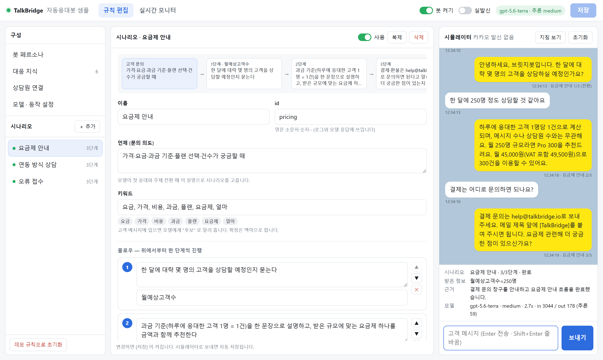
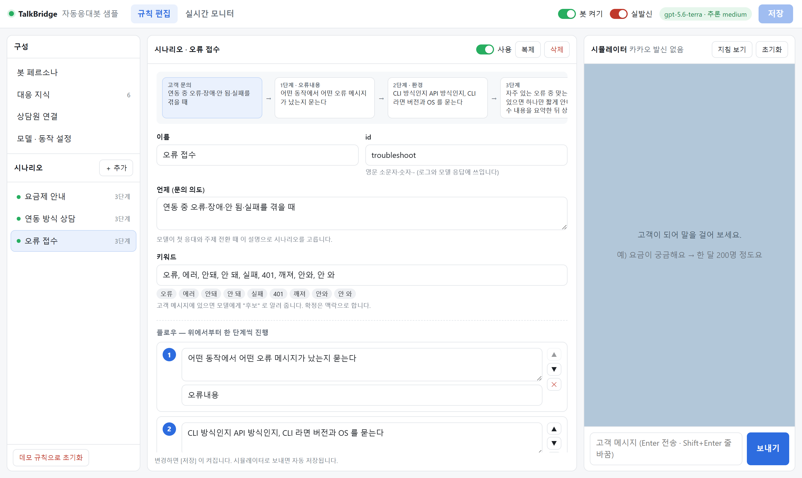

# 04 · CLI × Gateway — 자동응대봇 샘플

> 샘플 모음 인덱스는 [`../README.md`](../README.md) 를 보세요.
> 수신·서명·발신은 [01](../01-cli-gateway/) 과 같고, 조회는 [03](../03-cli-knowledge-graph/) 처럼 CLI `--json` 을 씁니다.
> 내부 동작(시퀀스·상태 전이·가드)과 **페르소나 → 지식 → 시나리오 추가 → 시뮬레이터 데모** 워크스루는
> [`docs/autoreply-bot-guide.md`](docs/autoreply-bot-guide.md) 에 화면과 함께 있습니다.

## 소개

카카오 상담톡에 문의가 들어오면 상담원보다 먼저 **자동응대봇이 받아서 답하는** 샘플입니다.
TalkBridge CLI 게이트웨이로 고객 메시지를 받고, OpenAI 로 답장을 만들어 CLI `send` 로 돌려보냅니다.
공인 도메인 없이 노트북에서 바로 돌아가며, 응대 규칙은 코드가 아니라 **웹 화면에서** 만듭니다.

**이런 때 쓰세요**

- 반복되는 첫 문의(요금·연동 방법·오류 접수)를 봇이 정리해서 상담원에게 넘기고 싶을 때
- 키워드 → 고정 문구 자동응답으로는 두 번째 답장부터 대화가 끊겨 아쉬웠을 때
- 우리 회사 지식·응대 절차를 넣은 AI 상담봇을 **실제 채널에 붙여 보기 전에** 과금 없이 다듬어 보고 싶을 때

**무엇이 들어 있나**

| | |
|---|---|
| **규칙 편집** | 봇 페르소나 · 대응 지식 카드 · **간단 시나리오**(어떤 문의일 때 → 1·2·3단계 → 완료 후 계속/상담원 연결/종료) · 상담원 연결 키워드 · 모델 설정 |
| **시뮬레이터** | 고객이 되어 말을 걸어 보는 창 — 같은 엔진으로 돌지만 카카오로는 보내지 않는다. 진행 중 단계·받은 정보·판단 근거·토큰이 함께 보인다 |
| **실시간 모니터** | 실제 상담방의 대화와 봇 답장, 방별 봇 상태(응대중/정지), 봇 활동 로그, 상담원 직접 답장 |
| **맥락 유지 엔진** | 같은 상담 세션 이력 + 진행 상태 + 규칙을 매 턴 모델에 넘겨 **첫 응대 이후에도 이야기가 이어진다** |
| **안전장치** | 내 발신 echo 무한 루프 차단 · 게이트웨이 재기동 시 과거 문의 일괄 답장 차단 · 사람이 답하면 봇 정지 · dry-run 기본 |

### 실상담 시뮬레이션 — 톡브릿지 채널에 실제로 문의해 봤습니다

아래는 테스트용 가상 대화가 아니라, **톡브릿지 내부에서 고객 역할로 실제 카카오톡 채널에 문의**하고
이 샘플이 **실발신으로 자동응대한 결과**입니다. 데모 규칙(톡브릿지 상담센터 — 요금·연동·오류 접수)을 그대로 썼습니다.


| seq | 고객(카카오톡) | 자동응대봇(실발신) | 엔진 판단 · 응답시간 |
|---|---|---|---|
| #34 → #35 | 안녕하세요 | 안녕하세요, 브릿지봇입니다. 무엇을 도와드릴까요? | 시나리오 없음 — 인사 후 문의 유형 확인 · 3.3s |
| #36 → #37 | 요금이 궁금해요 | 요금제 안내를 도와드릴게요. 한 달에 대략 몇 명의 고객을 상담할 예정이신가요? | **요금제 안내 1/3** 시작 · 3.1s |
| #38 → #39 | 한달 250명정도? | 하루에 응대한 고객 1명당 1건으로 계산돼요. 월 250명 규모라면 Pro 300을 추천드려요. 월 45,000원이며 VAT 포함 49,500원이고, 300건까지 이용할 수 있어요. | **요금제 안내 2/3** · `월예상고객수=250명` 기억 · 3.6s |

> 봇은 "250명정도?" 라는 짧은 답을 **직전에 자기가 한 질문(한 달 상담 고객 수)에 대한 대답**으로 받아 다음 단계로 넘어갔습니다 —
> 이 샘플이 보여주려는 "첫 응대 이후 맥락 유지" 가 실채널에서 그대로 동작한 장면입니다.
> 가운데 위 띠는 이 방의 봇 상태(`봇 응대중 · 요금제 안내 2/3단계 · 월예상고객수=250명`), 오른쪽은 봇 활동 로그(`발신됨` · 응답시간 · 판단 근거)입니다.
> 금액은 모두 규칙의 대응 지식(매뉴얼 요약의 요금표)에서 나온 값입니다. 상단 [실발신] 이 켜져 있어야 실제로 나가며, 끄면 같은 답장을 점선 말풍선(dry-run)으로만 보여 줍니다.
> 같은 날 같은 고객과의 대화는 몇 번을 주고받아도 상담 건수 1건입니다.



> 규칙은 이 화면에서 만들고 다듬습니다. 가운데는 시나리오 편집기(위쪽 플로우 미리보기 → 이름·의도·키워드 → 단계), 오른쪽은 카카오로 보내지 않는 **시뮬레이터**입니다.
> 고객이 "요금이 궁금해요" → "한 달 250명" → "결제는 어디로?" 라고 보내면, 봇이 1단계에서 받은 규모(250명)를 기억해
> 2단계에서 요금제를 추천하고 3단계로 마무리합니다. 아래 상태 칸은 진행 중 시나리오·단계·받은 정보·판단 근거·토큰입니다.
> `npm run screenshot` 으로 다시 만들 수 있습니다 (OpenAI 만 호출, 카카오 발신 없음).

**사양**

- 런타임: **Node.js 18+**, 의존성 **0개** (`node:http` · 내장 `fetch` 만)
- 프론트: **바닐라 JS** (프레임워크·번들러 없음)
- AI: OpenAI **Responses API** · 기본 `gpt-5.6-terra` · 추론 강도 `medium` — `.env` 와 웹 [설정] 에서 바꿀 수 있습니다
- 검증 환경: `talkbridge-dev` v1.1.0 / brand `crm-b3e696` / Windows 11 · Node 22.18 / 2026-09-14 — 시뮬레이터 · dry-run · **실채널 실발신 자동응대**(위 실상담 시뮬레이션) 확인

---

## 0. 핵심 — 첫 응대보다 "두 번째 답장" 이 어렵다

키워드 → 고정 문구 자동응답은 첫 마디까지만 됩니다. 고객이 "250명이요" 라고 답하는 순간
**무엇에 대한 250명인지** 알아야 다음 말을 할 수 있습니다. 이 샘플은 매 턴 세 가지를 모델에 줍니다.

```
① 대화 이력   CLI rooms --user --json 에서 "같은 상담 세션" 의 메시지만        ← 서버가 재기동해도 맥락 유지
② 진행 상태   방마다: 진행 중 시나리오 · 몇 단계 · 지금까지 받은 정보            ← 모델이 매 턴 갱신해 돌려준다
③ 규칙        페르소나 · 대응 지식 · 시나리오 플로우                              ← 웹에서 편집
```

모델은 JSON 스키마(strict)로 답합니다.

```json
{ "reply": "월 250명이면 Pro 300 을 추천드려요 …",
  "scenario_id": "pricing", "step_index": 2,
  "collected": [{ "name": "월예상고객수", "value": "250명" }],
  "scenario_completed": false, "handoff": false,
  "reason": "월 예상 고객 수를 받아 요금제를 추천함" }
```

그래서 이런 대화가 됩니다 (`npm run sim` 실측, gpt-5.6-terra · medium, 턴당 2~6초):

| 고객 | 봇 | 엔진 판단 |
|---|---|---|
| 요금이 궁금해요 | 한 달에 대략 몇 명의 고객을 상담할 예정이신가요? | 요금제 안내 1/3 |
| 한달에 250명 정도요 | 하루 응대 고객 1명당 1건 … 월 250명이면 Pro 300(월 45,000원)을 추천드려요 | 2/3 · `월예상고객수=250명` |
| 결제는 카드로 되나요? | 결제 방법은 help@talkbridge.io 로 문의해 주세요 … 더 궁금한 점 있으실까요? | 3/3 완료 |
| 연동은 뭘로 해야돼요? 저희는 도메인이 없어요 | 도메인이 없으시면 CLI+게이트웨이가 적합해요. 목표는 빠른 검증인가요, 24시간 운영인가요? | **연동 방식 상담으로 전환** · 1단계(도메인)는 이미 답해서 **건너뛰고 2단계** |
| 노트북에서 테스트만 해보려고요 | CLI+게이트웨이를 추천드려요 … 샘플 코드는 https://github.com/… | 3/3 완료 · 앞서 받은 정보 유지 |
| 웹훅이 계속 401이 떠요 | CLI 방식인가요, API 방식인가요? | **오류 접수로 전환** · `오류내용` 기록 |
| CLI 1.1.0이고 윈도우요 | 401 은 웹훅 시크릿 불일치일 때 … 상담원이 이어서 확인해 드릴게요 | 완료 → **상담원 연결** (봇 정지) |

---

## 1. 흐름

```
고객(카카오톡)
     │ 문의
     ▼
TalkBridge ──SSE──► talkbridge-dev gateway (내 PC 데몬)
                              │ 서명된 POST (본문 없는 신호)
                              ▼
                    이 샘플 서버 /webhook
                              │ ① 서명 검증 → ② 즉시 200 → ③ 멱등 → ④ 본문 보강 (rooms --user --json)
                              │
                              │ kind:"message" 만 ─► bot.js
                              │                      ⑤ 가드: 저널 재생? 봇 정지? → 건너뜀
                              │                      ⑥ 디바운스 2.5초 (끊어 보낸 여러 줄을 모음)
                              │                      ⑦ 이번 세션 이력 + 진행 상태 + 규칙 → OpenAI (Responses API)
                              │                      ⑧ 상담원 연결 / 완료 동작 판정
                              ▼
          실발신 ON ──► talkbridge-dev send ──► 고객        실발신 OFF(dry-run) ──► 모니터에만 표시
                              │
                              ▼
                    kind:"agent" echo ─► 봇이 보낸 게 아니면 "사람이 개입" → 그 방 봇 정지
```

---

## 2. 빠른 시작

```bash
# 0) 사전: CLI 설치 + 로그인 (한 번만) — CLI v1.1.0+ 필요 (--json)
npm install -g @blumn-dev/talkbridge-cli   # 운영은 @blumn-ai/talkbridge-cli
talkbridge-dev login
talkbridge-dev whoami

# 1) 환경 설정
cp .env.example .env
#   TB_BRAND           ← whoami 의 브랜드 키
#   TB_WEBHOOK_SECRET  ← 아무 긴 랜덤 문자열

# 2) OpenAI 키 — 파일로 (커밋 차단됨)
cp .secret/openai.json.tmp .secret/openai.json    # PowerShell: Copy-Item .secret/openai.json.tmp .secret/openai.json
#   api_key 를 채우고 첫 줄의 # 주석은 지워도, 둬도 됩니다
#   또는 환경변수 OPENAI_API_KEY

# 3) 진단 — [8] 에서 OpenAI 를 한 번 짧게 호출해 키·모델을 확인합니다
npm run doctor

# 4) 규칙부터 — 게이트웨이 없이도 됩니다
npm start                  # http://127.0.0.1:8792/  → 오른쪽 시뮬레이터로 대화
npm run sim                # 또는 터미널 시뮬레이터

# 5) 실제 상담에 붙이기
npm run gateway:setup      # sink → http://127.0.0.1:8792/webhook
npm run gateway:start
#   웹 상단 [봇 켜기] ON, [실발신] OFF(dry-run) 로 실제 문의에 어떤 답이 나가는지 먼저 확인
#   괜찮으면 [실발신] ON
```

> **처음엔 dry-run 으로.** 데모 규칙은 `실발신 OFF` 로 시작합니다. 실제 고객 메시지에 답장을 만들어
> [실시간 모니터] 에 점선 말풍선으로만 보여 주고 카카오로 보내지 않습니다.
> 발신은 **상담 건수를 소진**하고(하루 응대 고객 1명 = 1건), Free 는 30일 3건뿐입니다.

> **게이트웨이 sink 는 한 곳만 가리킵니다.** 01·03 을 쓰다 왔다면 `npm run gateway:setup` 으로 8792 로 돌려야 봇이 메시지를 받습니다
> (`doctor [4]` 가 포트 불일치를 경고합니다).

---

## 3. 규칙 구성 (웹)

| 화면 | 무엇을 | 모델에게 어떻게 전달되나 |
|---|---|---|
| **봇 페르소나** | 이름 · 말투 · 기본 지침(누구를 응대하고 어디까지 처리하는가) | 지침 머리 |
| **대응 지식** | 제목 + 내용 카드 (요금표, 규정, 자주 있는 오류, 문의 창구 …) | `## 대응 지식` — **여기 있는 사실만** 말하게 한다 |
| **시나리오** | 이름 · 언제(의도) · 키워드 · **플로우 단계** · 받을 정보 · 시나리오 지식 · 완료 후 동작 | `## 시나리오` + `## 현재 상태` |
| **상담원 연결** | 연결 키워드 · 연결 안내 · AI 오류 시 안내 | 키워드는 **모델을 부르지 않고** 결정적으로 처리 |
| **모델 · 동작 설정** | 모델 · 추론 강도 · 최대 글자 수 · 맥락 메시지 수 | Responses API 파라미터 |

- 저장하면 `data/bot.json` 에 씁니다(없으면 `data/demo-bot.json` 으로 시작). `bot.json` 은 커밋되지 않습니다.
- 시뮬레이터로 보내면 **자동 저장** 후 저장된 규칙으로 돕니다. [지침 보기] 는 모델에 실제로 가는 지침 전문입니다.
- 시나리오 **완료 후**: `계속 대화` · `상담원 연결`(그 방의 봇 정지) · `상담 종료`(실발신일 때 `end-with-bot`)



> 위쪽 플로우 미리보기가 편집 내용을 바로 따라옵니다. 단계마다 "받을 정보" 이름(`오류내용`, `환경`)을 적어 두면
> 봇이 대화에서 그 값을 뽑아 기억하고, 이미 받은 정보는 다시 묻지 않습니다.

### 데모 규칙 — 톡브릿지 상담센터

[`data/demo-bot.json`](data/demo-bot.json) 은 03 데모와 같은 설정(파트너 개발자들이 톡브릿지에 문의)입니다.
지식은 전부 [매뉴얼 요약](../../docs/talkbridge-manual-digest.md) 에서 옮겼습니다.

| 시나리오 | 플로우 | 완료 후 |
|---|---|---|
| 요금제 안내 | 월 예상 고객 수 → 과금 기준 + 요금제 추천 → 결제 문의처 안내 | 계속 대화 |
| 연동 방식 상담 | 공인 도메인 유무 → 목표(검증/운영) → CLI 또는 API 추천 + 샘플 링크 | 계속 대화 |
| 오류 접수 | 증상·오류 메시지 → 방식·버전·OS → 알려진 원인 1개 + 접수 요약 | 상담원 연결 |

---

## 4. 맥락을 잇는 방법 (구현)

| 문제 | 해결 | 위치 |
|---|---|---|
| 서버가 재기동하면 대화를 잊는다 | 대화 이력은 매 턴 **CLI 에서 다시 읽는다** (`rooms --user --json`) — 저장소는 TalkBridge 저널 | `bot.js` `transcriptFor()` |
| 지난 상담이 섞인다 | **같은 상담 세션만** — 마지막 `ended`/`expired` 이후 + 최신 고객 메시지의 `sessionId` 첫 seq 이후. `agent` 항목에는 `sessionId` 가 없어(v1.1.0 실측) seq 범위로 자른다 | `transcriptFor()` |
| 발신 직후 저널에 아직 없는 봇 답장 · dry-run 답장 | 방 상태의 `botReplies` 를 시각 순으로 끼워 넣는다 → dry-run 에서도 맥락이 이어진다 | `transcriptFor()` |
| 몇 단계였는지 · 무엇을 받았는지 | 방 상태 `{scenarioId, stepIndex, collected}` 를 지침의 `## 현재 상태` 로 주고, 모델이 갱신해 돌려준다. 없는 시나리오·범위 밖 단계는 엔진이 바로잡는다 | `takeTurn()` |
| 고객이 주제를 바꾼다 | 모델이 새 시나리오로 전환 — 받은 정보(`collected`)는 유지 | 지침 "시나리오 진행 방법" |
| 새 상담 · 종료 · 만료 | `reference`/`ended`/`expired` 웹훅에서 방 상태 초기화 (정지도 풀린다) | `onSessionBoundary()` |
| OpenAI 쪽 저장 | `store: false` — 대화를 OpenAI 대화 저장소에 남기지 않는다. 맥락은 매 턴 우리가 보낸다 | `openai.js` |

---

## 5. 자동응답 안전장치 — 이게 없으면 사고가 난다

| 위험 | 가드 | 설정 |
|---|---|---|
| **무한 루프** — 내 발신의 echo 에 또 답장 | `kind:"message"` 에서만 트리거. `agent` echo 는 사람 개입 판별에만 | — |
| **과거 문의 일괄 답장** — 게이트웨이 첫 기동·오프셋 유실 시 저널 전체 재생 | ① 부팅 시점 방별 `lastSeq` 이하 무시 ② 메시지 시각이 N초보다 오래되면 무시 | `TB_BOT_MAX_AGE_SEC=180` |
| 끊어 보낸 3줄에 답장 3개 | 마지막 메시지 뒤 대기 후 한 번에 | `TB_BOT_DEBOUNCE_MS=2500` |
| 생성 중 새 메시지 → 동시 답장 | 방별 직렬화, 끝난 뒤 한 번 더 | — |
| 이상 루프·스팸 | 한 방에 1분 5회 초과 시 봇 정지 | — |
| 사람과 봇이 동시에 답함 | 화면에서 상담원이 보내면 즉시 정지 · 다른 곳에서 보낸 `agent` echo(봇 답장과 본문 불일치)도 정지 | [실시간 모니터] 에서 재개 |
| AI 장애로 고객 방치 | 오류 안내 문구를 보내고 상담원 연결 | 규칙 [상담원 연결] |
| 없는 요금·약속을 지어냄 | 지식에 있는 사실만 · 모르면 확인 필요 + 연결 제안 · 프롬프트 인젝션 거부 | 지침 "반드시 지킬 것" |
| 실수로 실발신 | 데모는 dry-run 시작 · 실발신 켤 때 확인창 · `doctor [9]` 경고 | 상단 [실발신] |

---

## 6. 구조

```
04-cli-autoreply-bot/
├─ server/
│  ├─ index.js        HTTP 라우팅 + 부팅 백필(방별 lastSeq → 재생 가드)
│  ├─ config.js       .env 로더 + ★ OpenAI 키 찾기(env → 파일) · 모델 기본값
│  ├─ openai.js       ★ Responses API 호출 (JSON 스키마 strict · reasoning.effort · store:false)
│  ├─ rules.js        ★ 규칙 정규화·저장 (data/bot.json, 원자적 쓰기)
│  ├─ bot.js          ★ 엔진 — 지침 조립 · 세션 이력 · 한 턴 · 가드 · 시뮬레이터
│  ├─ webhook.js      03 과 동일 + 봇 훅 3곳 (message / agent echo / 세션 경계)
│  ├─ cli.js          03 의 cli.js 에서 knowledge 부분만 뺌 (--json)
│  ├─ signature.js    01·02·03 과 바이트 동일
│  ├─ store.js        01·02·03 과 바이트 동일
│  └─ sse.js          01·02·03 과 바이트 동일
├─ public/            규칙 편집 · 시뮬레이터 · 실시간 모니터 (바닐라 JS)
├─ data/
│  ├─ demo-bot.json   데모 규칙 (커밋)
│  └─ bot.json        웹에서 저장한 규칙 (커밋 제외)
├─ .secret/
│  ├─ openai.json.tmp 키 없는 템플릿 (커밋)
│  └─ openai.json     실제 키 (커밋 제외)
├─ scripts/
│  ├─ doctor.mjs      진단 9종 (01 의 7종 + OpenAI 호출 + 규칙)
│  ├─ gateway.mjs     sink 구성 + 데몬 수명주기 (03 과 동일)
│  ├─ sim.mjs         터미널 시뮬레이터
│  └─ screenshot.mjs  소개용 스크린샷 (Playwright, 선택)
├─ docs/
│  ├─ autoreply-bot-guide.md   개발 가이드 · 워크스루 (구조 · 시퀀스 · 상태 전이 · 가드 · 화면별 절차)
│  ├─ walkthrough/*.png        워크스루 화면 10장
│  └─ screenshot*.png          소개용 (실상담 시뮬레이션 · 규칙 편집 · 시나리오)
└─ .env.example
```

### 서버 API

| 메서드 | 경로 | 설명 |
|---|---|---|
| POST | `/webhook` | 게이트웨이 수신 |
| GET | `/api/events` | SSE — `inbound` · `bot` · `bot-state` · `rules` |
| GET | `/api/me` | `whoami` + AI 상태(모델·추론 강도·키 출처, 키는 마스킹) |
| GET · PUT | `/api/bot/rules` | 규칙 조회 · 저장(정규화 + `warnings`) |
| POST | `/api/bot/rules/reset` | 데모 규칙으로 초기화 |
| POST | `/api/sim/message` · `/api/sim/reset` | 시뮬레이터 한 턴 · 초기화 (카카오 발신 없음) |
| GET | `/api/sim/prompt` | 모델 지침 전문 |
| GET | `/api/rooms` · `/api/rooms/:userKey/messages` | `rooms --json` + 방별 봇 상태 |
| GET | `/api/bot/activity` | 최근 봇 활동 |
| POST | `/api/bot/rooms/:userKey/pause` · `resume` | 방별 봇 정지·재개 |
| POST | `/api/send` | 상담원 직접 답장 (`send`) — 그 방의 봇은 먼저 정지 |

---

## 7. 설정 — 모델·키

| 변수 | 기본값 | 설명 |
|---|---|---|
| `OPENAI_MODEL` | `gpt-5.6-terra` | 웹 [설정] 의 모델이 비어 있을 때 쓰인다 |
| `OPENAI_REASONING_EFFORT` | `medium` | `none`·`minimal`·`low`·`medium`·`high` — 모델마다 지원 값이 다르다. 비우면 모델 기본 |
| `OPENAI_API_KEY` | — | 있으면 파일보다 우선 (운영·CI 권장) |
| `OPENAI_KEY_FILE` | — | 키 JSON 경로 |
| (자동) | `.secret/openai.json` → `../../.secret/openai.json` | 샘플 폴더, 그다음 저장소 루트 |
| `OPENAI_BASE_URL` | `https://api.openai.com/v1` | 호환 엔드포인트 |
| `OPENAI_TIMEOUT_MS` | `60000` | |
| `TB_BOT_MAX_AGE_SEC` | `180` | 재생 가드 |
| `TB_BOT_DEBOUNCE_MS` | `2500` | 모아 답하기 |
| `TB_BOT_FILE` | `data/bot.json` | 규칙 파일 |
| `PORT` | `8792` | 01=8787 · 02=8788 · 03=8789 · 8790/8791 은 CLI 지식 조회 API·웹뷰 |

**키 파일 규칙** — `.secret/*.json` 은 `.gitignore` 로 커밋이 막혀 있고 `*.tmp`(키 없는 템플릿)만 커밋됩니다.
키는 로그·화면·오류 메시지에 앞 7자·뒤 4자 외에는 나오지 않습니다.

> CLI 설정(`~/.bridge-agent/config.json`)에도 AI 공급자 항목이 있지만 이 샘플은 **쓰지 않습니다** —
> 봇은 이 서버가 직접 OpenAI 를 호출합니다. 파트너 서버의 규칙·지식·과금 경계를 파트너 코드 안에 두기 위해서입니다.

---

## 8. 운영으로 옮길 때

| 지금(샘플) | 운영에서 |
|---|---|
| 규칙 = JSON 파일 하나 | DB + 변경 이력 + 승인(누가 언제 무엇을 바꿨나) · 시나리오 버전 |
| 인증 없는 규칙 편집 화면 (`127.0.0.1` 바인딩) | 관리자 로그인·권한. 외부 노출 시 TLS 필수 |
| 방 상태(시나리오·단계·정지) 인메모리 | DB 또는 Redis — 다중 인스턴스에서 방별 락 |
| 대화 이력을 매 턴 CLI 로 조회 | 수신 시 메시지 테이블에 적재하고 거기서 조회 → `02-api-webhook` 의 REST |
| CLI 게이트웨이(인메모리 재시도 3회) | 호스티드 게이트웨이(영속 재시도) → `02-api-webhook` |
| 지식을 지침에 통째로 | 지식이 커지면 검색(RAG) — 03 의 그래프나 벡터 검색으로 관련 항목만 |
| 품질 확인 = 시뮬레이터 눈검사 | 대표 대화 세트로 회귀 테스트(시나리오·단계·handoff 기대값) |
| 사람 개입 판별 = 본문 일치 | 발신번호(serial) 로 판별 |

---

## 9. 문제 해결

| 증상 | 원인·조치 |
|---|---|
| 상단에 `OpenAI 키 없음` | `.secret/openai.json` 이 없거나 `api_key` 가 템플릿 값 → `npm run doctor [8]` |
| `OpenAI 404 … 모델을 이 키로 쓸 수 없음` | 웹 [설정] 에서 모델 변경, 또는 `OPENAI_MODEL` |
| `OpenAI 400 … reasoning` | 이 모델은 추론 강도를 받지 않음 → [설정] 추론 강도를 비우고 `.env` 도 비운다 |
| 고객이 보냈는데 봇이 조용하다 | ① [봇 켜기] ② `doctor [4]` sink 포트가 8792 인지 ③ [봇 활동] 에 `건너뜀` 사유(정지·오래된 메시지) ④ 방이 `봇 정지` 면 [봇 재개] |
| 게이트웨이 재기동 후 과거 문의에 답장이 나갈까 걱정 | 부팅 `lastSeq` + `TB_BOT_MAX_AGE_SEC` 가드로 건너뜀 — [봇 활동] 에 `저널 재생으로 보고 응답 안 함` |
| 봇이 답장했는데 카카오에 안 보인다 | [실발신] 이 꺼져 있음(dry-run). 모니터의 점선 말풍선이 dry-run 답장 |
| 발신이 `-509` 로 실패 | 세션이 종료·만료됨. 새 문의가 와야 재개 |
| 답이 느리다 | 추론 강도를 `low` 로, 또는 `맥락 메시지 수`·지식 분량을 줄인다 (턴당 입력 ≈ 3천 토큰이 대부분 지침) |
| 웹훅이 전부 401 | CLI 의 `--webhook-secret` 과 `.env` 의 `TB_WEBHOOK_SECRET` 불일치 → `npm run gateway:setup` |

---

## 10. 참고

- 샘플 모음 인덱스: [`../README.md`](../README.md)
- 공개 매뉴얼: <https://api.talkbridge.io/>
- 매뉴얼 요약: [`../../docs/talkbridge-manual-digest.md`](../../docs/talkbridge-manual-digest.md)
- OpenAI Responses API: <https://platform.openai.com/docs/api-reference/responses>
- 기술 문의: TalkBridge 디스코드 커뮤니티 / `help@talkbridge.io`
